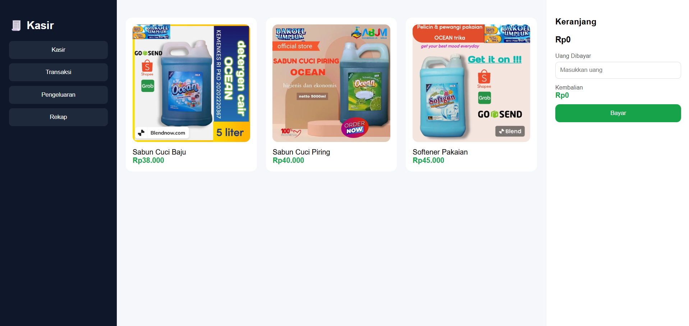
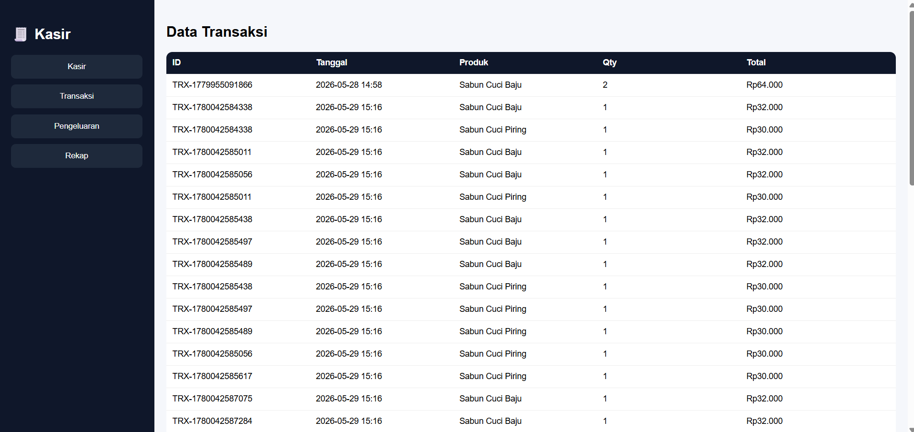
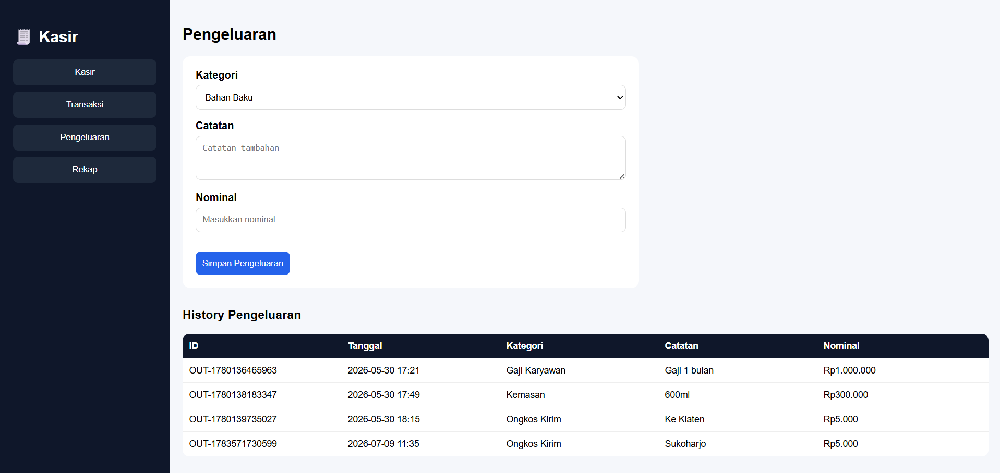
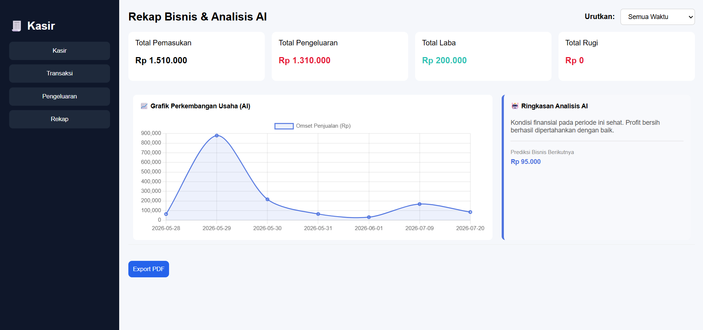

<div align="center">

# 🧾 Kasir Digital UMKM Modern
### Sistem Kasir & Pencatatan Keuangan Sederhana untuk UMKM

**Catat transaksi, kelola produk (lengkap dengan gambar), dan pantau pengeluaran dalam satu aplikasi ringan — langsung dari Google Sheets.**

[](https://script.google.com/macros/s/AKfycbw7Iq0QTnEt2q7AuC0Kj2vLrNMP8d9yufRJtp2cYHBSjiyBZkMUbRbGgjfFshyGepHi/exec)
[](https://docs.google.com/spreadsheets/d/1BJjrzxlBJAS9kQjDUhveEDbL0CrzNV2lJsSAe498v6U/edit?usp=sharing)
[](https://script.google.com)

</div>

---

## 📌 Tentang Aplikasi

**Kasir Digital UMKM Modern** adalah sistem kasir ringan untuk pelaku usaha kecil (warung, kafe, toko) yang membantu mencatat transaksi penjualan, mengelola daftar produk lengkap dengan gambar, dan mencatat pengeluaran operasional — tanpa perlu instalasi, tanpa langganan software kasir berbayar.

Seluruh sistem berjalan di atas **Google Apps Script** sebagai backend dan **Google Sheets** sebagai database — tanpa hosting berbayar, tanpa server terpisah, cukup akun Google.

> Cocok untuk usaha kecil yang selama ini masih catat transaksi manual di buku atau nota, dan butuh cara cepat untuk tahu omzet & pengeluaran tanpa ribet.

---

## ✨ Fitur Utama

- 🛒 **Menu Kasir/Transaksi** — catat penjualan harian dengan cepat, transaksi bisa disimpan sekaligus dalam satu batch (`simpanTransaksi`)
- 📦 **Menu Produk** — kelola daftar produk (ID, nama, harga, stok) lengkap dengan **gambar produk** (URL gambar dari Google Drive) yang tampil langsung di menu kasir
- 💸 **Menu Pengeluaran** — catat biaya operasional (belanja bahan, listrik, dll) supaya arus kas lebih jelas
- 📊 **Menu Rekap** — lihat ringkasan omzet, pengeluaran, dan laba dalam satu tampilan
- 🚀 **Tanpa login** — langsung akses dan pakai, tidak perlu setup akun
- 🗂️ Semua data tersimpan otomatis di Google Sheets, bisa dicek/diedit manual kapan saja
- 📱 Tampilan responsif, bisa diakses dari HP maupun desktop cukup lewat browser

---

## 🖥️ Live Demo

| | |
|---|---|
| **Aplikasi** | [Buka Kasir Digital UMKM Modern](https://script.google.com/macros/s/AKfycbw7Iq0QTnEt2q7AuC0Kj2vLrNMP8d9yufRJtp2cYHBSjiyBZkMUbRbGgjfFshyGepHi/exec) |
| **Database (Spreadsheet)** | [Sistem Kasir](https://docs.google.com/spreadsheets/d/1BJjrzxlBJAS9kQjDUhveEDbL0CrzNV2lJsSAe498v6U/edit?usp=sharing) |

> ⚠️ Aplikasi ini tidak menggunakan sistem login — siapa pun yang punya link bisa langsung mengakses dan menggunakan. Cocok untuk pemakaian internal 1 kasir/1 outlet.

---

## 🖼️ Screenshot

| Menu Kasir | Menu Transaksi |
|---|---|
|  |  |

| Menu Pengeluaran | Menu Rekap |
|---|---|
|  |  |

> 📷 Produk di menu Kasir tampil lengkap dengan gambar — gambar disimpan di Google Drive dan direferensikan lewat kolom `Gambar URL` di sheet `Produk`.

---

## 🛠️ Tech Stack

| Teknologi | Kegunaan |
|---|---|
| [Google Apps Script](https://script.google.com) | Backend — logika bisnis & API |
| [Google Sheets](https://sheets.google.com) | Database utama (tanpa perlu SQL/hosting DB terpisah) |
| HTML Service (Apps Script) | Frontend — single-page app, HTML + CSS + JS dalam satu file |
| Vanilla JavaScript | Interaksi client-side (tanpa framework, tanpa build step) |

Tidak ada dependency eksternal, tidak ada `npm install`, tidak ada biaya hosting — semuanya berjalan di infrastruktur Google.

---

## 🚀 Cara Menjalankan / Deploy Sendiri

### Prasyarat
- Akun Google (gratis)
- Salin spreadsheet database (lihat di atas) ke Drive kamu sendiri, atau siapkan spreadsheet baru dengan struktur sheet yang sama

### 1. Siapkan Spreadsheet
1. Buka [spreadsheet database](https://docs.google.com/spreadsheets/d/1BJjrzxlBJAS9kQjDUhveEDbL0CrzNV2lJsSAe498v6U/edit?usp=sharing) → `File > Buat salinan` ke Drive kamu
2. Copy **ID spreadsheet** dari URL hasil salinan (bagian antara `/d/` dan `/edit`)

### 2. Siapkan Apps Script
1. Buat project Apps Script baru → [script.google.com](https://script.google.com)
2. Buat 4 file berikut, isi persis sesuai kode di project ini:
   - `Kode.gs` (backend — semua logika & API)
   - `index.html` (halaman utama/kerangka SPA)
   - `script.html` (logika JavaScript client-side)
   - `style.html` (styling/CSS)
3. Pastikan project terhubung ke spreadsheet database (aplikasi ini berjalan sebagai **container-bound script** — dibuat langsung dari menu `Ekstensi > Apps Script` di spreadsheet, sehingga otomatis terhubung ke spreadsheet aktif lewat `SpreadsheetApp.getActive()`)
4. Simpan semua file

### 3. Deploy sebagai Web App
1. `Deploy > New deployment`
2. Pilih tipe **Web app**
3. Execute as: **Me** — Who has access: **Anyone**
4. Klik **Deploy**, copy URL `.../exec` yang muncul — itu URL aplikasi kamu

### 4. Update Deployment (kalau ada perubahan kode)
`Deploy > Manage deployments > (pensil edit) > New version > Deploy` — URL tetap sama, tidak perlu buat deployment baru tiap kali update kode.

---

## 🗄️ Struktur Database (Google Sheets)

| Sheet | Isi |
|---|---|
| `TRANSAKSI` | Data transaksi penjualan (tanggal, item, qty, harga, total) |
| `PENGELUARAN` | Data pengeluaran operasional (tanggal, keterangan, nominal) |
| `REKAP` | Ringkasan omzet, pengeluaran, dan laba per periode |

> 💾 Fungsi baca/tulis data di `Kode.gs` bekerja **berdasarkan nama kolom**, bukan posisi/urutan — jadi menambah kolom baru di spreadsheet tidak akan merusak data yang sudah ada.

---

## 📁 Struktur Project

```
kasir-app/
├── Kode.gs      # Backend: semua logika bisnis & API (google.script.run)
└── Index.html   # Frontend: menu kasir, transaksi, pengeluaran, rekap (1 file, SPA)
```

---

## 🗺️ Roadmap

- [x] Menu Kasir/Transaksi
- [x] Menu Pengeluaran
- [x] Menu Rekap omzet & pengeluaran
- [ ] Cetak/unduh struk transaksi
- [ ] Tracking stok barang
- [ ] Login multi-user (kasir & pemilik)
- [ ] Grafik omzet harian/bulanan di dashboard

---

<div align="center">

🧾 Dibangun di atas Google Apps Script — gratis, tanpa server, tanpa biaya hosting.

</div>
