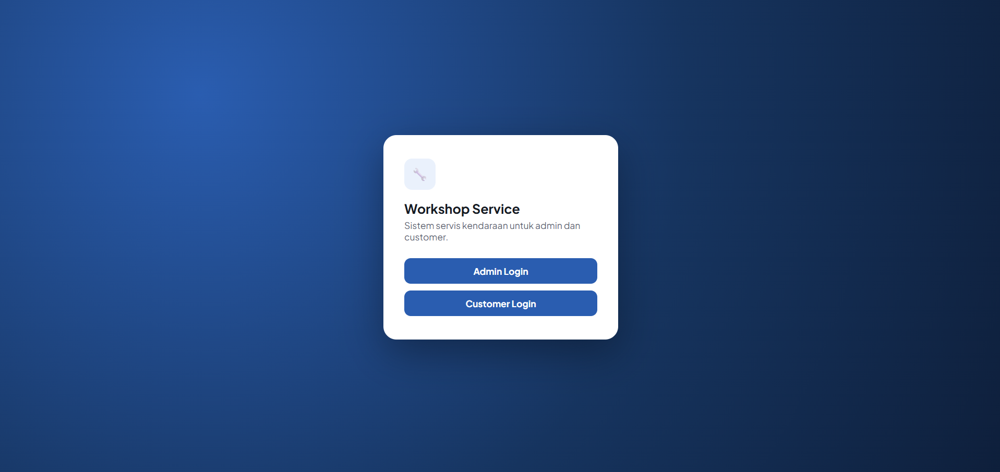
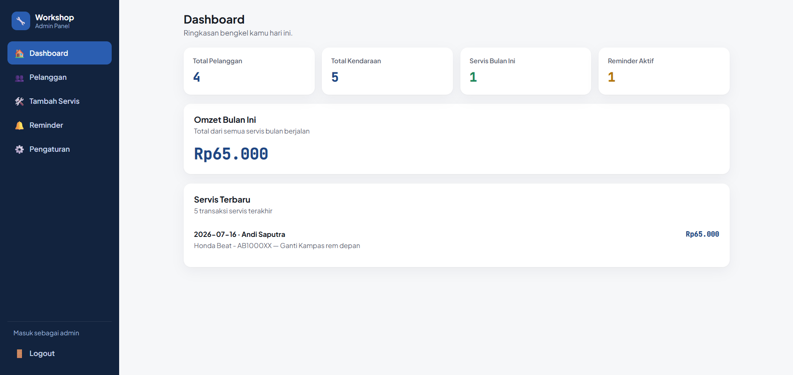
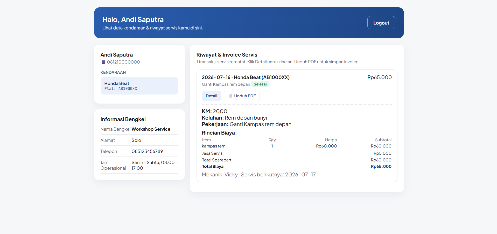

<div align="center">

# 🔧 Workshop Service
### Sistem Manajemen Servis Kendaraan — Admin & Customer Portal

**Kelola pelanggan, kendaraan, dan riwayat servis dalam satu dashboard simpel — langsung dari Google Sheets.**

[](https://script.google.com/macros/s/AKfycbwIL25Rzyf_Mtbw4mrGddH194jn-lVGdXEOYj1fCqn-GGZXlfAm74ShxmPLBfA5qADlaQ/exec)
[](https://docs.google.com/spreadsheets/d/1lYv5oDbkCGZTq5OXybpcZQonE1L8QOWDL8GQyuI61WE/edit?usp=sharing)
[](https://script.google.com)

</div>

---

## 📌 Tentang Aplikasi

**Workshop Service** adalah aplikasi web internal untuk bengkel kendaraan (motor/mobil) yang membantu admin mengelola data pelanggan, kendaraan, dan riwayat servis — sekaligus memberi pelanggan akses mandiri untuk melihat riwayat servis dan mengunduh invoice mereka sendiri.

Seluruh sistem berjalan di atas **Google Apps Script** sebagai backend dan **Google Sheets** sebagai database — tanpa hosting berbayar, tanpa server terpisah, cukup akun Google.

> Tidak perlu lagi catat servis manual di buku, tidak perlu bolak-balik menu untuk cek riwayat pelanggan, dan pelanggan bisa cek sendiri riwayat servis kendaraannya kapan saja.

---

## ✨ Fitur Utama

**Admin Panel**
- 🔐 Login admin dengan username & password
- 🏠 Dashboard ringkasan — total pelanggan, kendaraan, servis bulan ini, omzet, reminder aktif
- 👥 Kelola pelanggan & kendaraan dalam satu halaman (tidak perlu pindah-pindah menu)
- 🛠️ Tambah & edit servis dengan rincian sparepart per item (nama, qty, harga → subtotal otomatis)
- 🔔 Reminder servis berikutnya + kirim pengingat lewat WhatsApp (link `wa.me` otomatis terisi nomor & pesan)
- ⚙️ Pengaturan info bengkel (nama, alamat, telepon, jam operasional) yang tampil di invoice & dashboard customer

**Customer Portal**
- 🔑 Login tanpa password — cukup No. HP + Plat Nomor
- 📋 Lihat semua kendaraan miliknya & riwayat servis lengkap tiap kendaraan
- 📄 Unduh invoice PDF per transaksi servis (dirender otomatis oleh server, bukan lewat dialog print)

**Umum**
- 📱 Tampilan responsif — layar penuh di desktop, menu bawah (bottom nav) di HP
- 🗂️ Semua data tersimpan di Google Sheets, bisa dicek/diedit manual kapan saja
- 🧾 Sheet `RINGKASAN` otomatis merangkum data pelanggan + kendaraan jadi satu tabel, biar tidak perlu cross-check `customer_id` manual

---

## 🖥️ Live Demo

| | |
|---|---|
| **Aplikasi** | [Buka Workshop Service](https://script.google.com/macros/s/AKfycbwIL25Rzyf_Mtbw4mrGddH194jn-lVGdXEOYj1fCqn-GGZXlfAm74ShxmPLBfA5qADlaQ/exec) |
| **Database (Spreadsheet)** | [WORKSHOP_DB_02](https://docs.google.com/spreadsheets/d/1lYv5oDbkCGZTq5OXybpcZQonE1L8QOWDL8GQyuI61WE/edit?usp=sharing) |

### Akun Demo

| Role | Kredensial |
|---|---|
| **Admin** | Username: `admin` &nbsp;·&nbsp; Password: `admin123` |
| **Customer** | No. HP: `081210000000` &nbsp;·&nbsp; Plat: `AB1000XX` |

> ⚠️ Login Customer tidak pakai password — sistem memverifikasi kombinasi **No. HP + Plat Nomor** harus cocok dengan data yang ada di sheet `CUSTOMERS` & `VEHICLES`.

---

## 🖼️ Screenshot

| Login | Dashboard Admin |
|---|---|
|  |  |

| Dashboard Customer |
|---|
|  |

---

## 🛠️ Tech Stack

| Teknologi | Kegunaan |
|---|---|
| [Google Apps Script](https://script.google.com) | Backend — logika bisnis, API, generate PDF |
| [Google Sheets](https://sheets.google.com) | Database utama (tanpa perlu SQL/hosting DB terpisah) |
| HTML Service (Apps Script) | Frontend — single-page app, HTML + CSS + JS dalam satu file |
| Vanilla JavaScript | Interaksi client-side (tanpa framework, tanpa build step) |

Tidak ada dependency eksternal, tidak ada `npm install`, tidak ada biaya hosting — semuanya berjalan di infrastruktur Google.

---

## 🚀 Cara Menjalankan / Deploy Sendiri

### Prasyarat
- Akun Google (gratis)
- Salin spreadsheet database (lihat di atas) ke Drive kamu sendiri, atau siapkan spreadsheet baru dengan struktur sheet yang sama

### 1. Siapkan Spreadsheet
1. Buka [spreadsheet database](https://docs.google.com/spreadsheets/d/1lYv5oDbkCGZTq5OXybpcZQonE1L8QOWDL8GQyuI61WE/edit?usp=sharing) → `File > Buat salinan` ke Drive kamu
2. Copy **ID spreadsheet** dari URL hasil salinan (bagian antara `/d/` dan `/edit`)

### 2. Siapkan Apps Script
1. Buat project Apps Script baru → [script.google.com](https://script.google.com)
2. Buat 3 file berikut, isi persis sesuai kode di project ini:
   - `Kode.gs` (backend — semua logika & API)
   - `Index.html` (frontend — landing, admin panel, dashboard customer, jadi 1 file)
   - `InvoicePdf.html` (template invoice PDF)
3. Di `Kode.gs`, ganti nilai `SPREADSHEET_ID` di baris paling atas dengan ID spreadsheet hasil salin tadi
4. Simpan semua file

### 3. Inisialisasi Sheet
Semua sheet yang dibutuhkan (`CUSTOMERS`, `VEHICLES`, `SERVICES`, `SERVICE_ITEMS`, `REMINDERS`, `WA_LOG`, `SETTINGS`, `RINGKASAN`, `ADMINS`) akan **otomatis dibuat** dengan header yang benar saat aplikasi pertama kali diakses (lewat fungsi `ensureSheets`, dipanggil otomatis di `doGet`). Kalau mau memicunya manual, jalankan fungsi `ensureSheets` dari editor.

Tambahkan minimal 1 baris di sheet `ADMINS` untuk bisa login sebagai admin:

| admin_id | username | password |
|---|---|---|
| A001 | admin | admin123 |

### 4. Deploy sebagai Web App
1. `Deploy > New deployment`
2. Pilih tipe **Web app**
3. Execute as: **Me** — Who has access: **Anyone**
4. Klik **Deploy**, copy URL `.../exec` yang muncul — itu URL aplikasi kamu

### 5. Update Deployment (kalau ada perubahan kode)
`Deploy > Manage deployments > (pensil edit) > New version > Deploy` — URL tetap sama, tidak perlu buat deployment baru tiap kali update kode.

---

## 🗄️ Struktur Database (Google Sheets)

| Sheet | Isi |
|---|---|
| `ADMINS` | Akun login admin (username, password) |
| `CUSTOMERS` | Data pelanggan (nama, hp, alamat) |
| `VEHICLES` | Data kendaraan per pelanggan (no_polisi, merk, tipe, tahun, no_mesin, no_rangka) |
| `SERVICES` | Transaksi servis (tanggal, km, keluhan, pekerjaan, biaya, status, dll) |
| `SERVICE_ITEMS` | Rincian sparepart per transaksi servis (nama_sparepart, qty, harga, subtotal) |
| `REMINDERS` | Jadwal pengingat servis berikutnya per kendaraan |
| `WA_LOG` | Catatan riwayat pengingat yang sudah dikirim lewat WhatsApp |
| `SETTINGS` | Info bengkel (nama, alamat, telepon, jam operasional) — tampil di invoice & dashboard customer |
| `RINGKASAN` | Ringkasan gabungan pelanggan + kendaraan (auto-generate, khusus untuk kemudahan cek manual) |

> 💾 Semua fungsi baca/tulis data di `Kode.gs` bekerja **berdasarkan nama kolom**, bukan posisi/urutan — jadi menambah kolom baru di spreadsheet tidak akan merusak data yang sudah ada.

---

## 🧰 Fungsi Maintenance (jalankan manual dari editor Apps Script bila perlu)

| Fungsi | Kegunaan |
|---|---|
| `ensureSheets` | Membuat/melengkapi sheet & header yang belum ada |
| `refreshRingkasan` | Membangun ulang sheet `RINGKASAN` dari data `CUSTOMERS` + `VEHICLES` |
| `fixLeadingZeroPhones` | Memperbaiki nomor HP yang kehilangan angka 0 di depan (karena tersimpan sebagai angka) |
| `fixBrokenYearCells` | Memperbaiki kolom `tahun` di `VEHICLES` yang kebetulan tersimpan sebagai tanggal/waktu penuh |
| `cleanupServiceItemsSheet` | Membersihkan kolom/baris kosong sisa percobaan di `SERVICE_ITEMS` |
| `debugServiceItems` | Menampilkan isi mentah sheet `SERVICE_ITEMS` di Log Eksekusi, untuk keperluan debug |
| `anonymizeTestData` | Mengganti semua nama, No. HP, alamat, dan plat nomor jadi data dummy (berguna sebelum demo/jual ke orang lain) — **permanen, backup dulu spreadsheet-nya kalau perlu** |

---

## 👥 Role & Akses

| Role | Akses |
|---|---|
| **Admin** | Dashboard, kelola pelanggan & kendaraan, tambah/edit servis, kirim reminder WA, atur info bengkel |
| **Customer** | Lihat kendaraan & riwayat servis miliknya sendiri, unduh invoice PDF |

---

## 📁 Struktur Project

```
workshop-service/
├── Kode.gs          # Backend: semua logika bisnis & API (google.script.run)
├── Index.html        # Frontend: landing + admin panel + dashboard customer (1 file, SPA)
└── InvoicePdf.html   # Template invoice, dirender server-side jadi PDF
```

---

## 🗺️ Roadmap

- [x] Login Admin & Customer terpisah
- [x] Kelola pelanggan, kendaraan, & riwayat servis dalam satu alur
- [x] Rincian sparepart per item dengan subtotal otomatis
- [x] Invoice PDF otomatis (server-side render, bukan lewat dialog print)
- [x] Reminder servis + link WhatsApp otomatis terisi
- [x] Halaman Pengaturan info bengkel
- [x] Tampilan responsif (desktop & mobile)
- [ ] Kirim WhatsApp otomatis tanpa klik manual (opsional, lewat API pihak ketiga seperti Fonnte — belum dipakai supaya tetap gratis & simpel)
- [ ] Tracking stok sparepart (sheet `MASTER_SPAREPART` sudah disiapkan, belum disambungkan ke sistem)
- [ ] Ekspor laporan servis bulanan ke PDF/Excel
- [ ] Multi-cabang / multi-bengkel dalam satu sistem

---

<div align="center">

🔧 Dibangun di atas Google Apps Script — gratis, tanpa server, tanpa biaya hosting.

</div>
