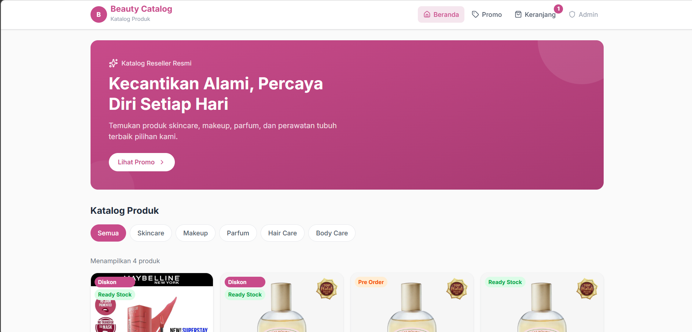
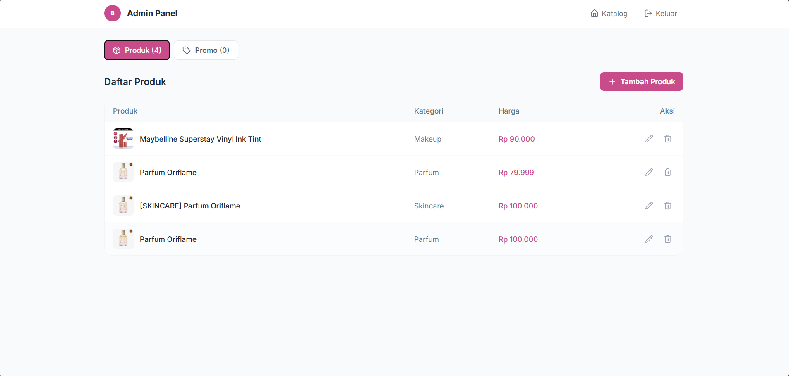
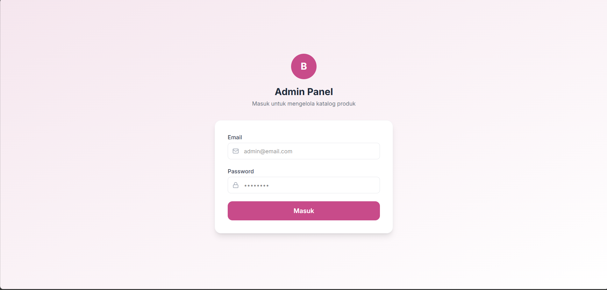

<div align="center">

# 🛍️ Katalog Reseller Online
### Template Website Katalog Produk untuk Reseller Modern

**Pamerkan produk, terima order lewat WhatsApp, kelola semua dari satu dashboard admin.**

[](https://catalog-reseller.vercel.app/)
[](https://reactjs.org)
[](https://supabase.com)
[](https://vercel.com)

</div>

---

## 📌 Tentang Aplikasi

**Katalog Reseller Online** adalah template aplikasi web katalog produk yang dirancang untuk reseller (skincare, makeup, fashion, atau produk lainnya) yang ingin punya toko online sendiri — tanpa perlu marketplace, tanpa biaya komisi, dan tetap memproses order lewat WhatsApp seperti biasa.

> Pelanggan lihat katalog & pilih produk di web, klik satu tombol langsung terhubung ke WhatsApp dengan pesan pesanan yang sudah tersusun rapi — reseller tinggal proses seperti biasa.

Seluruh identitas toko (nama, warna, tagline) bisa diganti dari satu file konfigurasi, jadi template ini bisa dipakai ulang untuk reseller produk apa pun.

---

## ✨ Fitur Utama

- 🏠 **Beranda Katalog** — Banner promo + grid produk (foto, nama, kategori, harga)
- 🔎 **Filter Kategori** — Skincare, Makeup, Parfum, Hair Care, Body Care (bisa disesuaikan)
- 📦 **Detail Produk** — Deskripsi lengkap + tombol "Order via WhatsApp" dengan pesan otomatis
- 🛒 **Keranjang Belanja** — Atur jumlah produk, total harga otomatis, checkout lewat WhatsApp
- 🏷️ **Halaman Promo** — Daftar promo aktif & promo yang sudah berakhir
- 🔐 **Admin Panel** — Login khusus admin untuk kelola produk & promo
- 🖼️ **Upload Gambar** — Upload foto produk langsung ke Cloudinary dari dashboard admin
- 🎨 **Branding Terpusat** — Ganti nama toko, tagline, dan warna tema dari satu file
- 🔒 **Keamanan Data** — Row Level Security (RLS) Supabase — baca bebas, tulis hanya admin
- 📱 **Responsive** — Tampilan optimal di desktop maupun mobile

---

## 🖥️ Screenshot

| Beranda | Dashboard Admin |
|---|---|
|  |  |

| Login Admin |
|---|
|  |

---

## 🛠️ Tech Stack

| Teknologi | Kegunaan |
|---|---|
| [React 19](https://reactjs.org) + [Vite 8](https://vitejs.dev) | Framework & build tool frontend |
| [Tailwind CSS 4](https://tailwindcss.com) | Styling & desain UI |
| [Supabase](https://supabase.com) | Database PostgreSQL & autentikasi |
| [Cloudinary](https://cloudinary.com) | Upload & hosting gambar produk/promo |
| [React Router v7](https://reactrouter.com) | Client-side routing & route guard |
| [Lucide React](https://lucide.dev) | Icon library |
| [Vercel](https://vercel.com) | Hosting & deployment |

---

## 🚀 Cara Menjalankan Lokal

### Prasyarat
- Node.js versi 18 atau lebih baru
- Akun [Supabase](https://supabase.com) (gratis)
- Akun [Cloudinary](https://cloudinary.com) (gratis)
- Akun [Vercel](https://vercel.com) (gratis, untuk deploy)

### 1. Clone / Extract Project

```bash
cd reseller-catalog-template
```

### 2. Install Dependencies

```bash
npm install
```

### 3. Setup Environment Variables

Salin dari `.env.example`:

```bash
cp .env.example .env
```

Isi `VITE_SUPABASE_URL`, `VITE_SUPABASE_ANON_KEY`, `VITE_CLOUDINARY_CLOUD_NAME`, `VITE_CLOUDINARY_UPLOAD_PRESET`, dan `VITE_WHATSAPP_NUMBER`.

> Lihat cara mendapatkan nilai Supabase di bagian [Setup Supabase](#️-setup-supabase) di bawah.

### 4. Jalankan Development Server

```bash
npm run dev
```

Buka [http://localhost:5173](http://localhost:5173) di browser.

---

## 🗄️ Setup Supabase

### 1. Buat Project Supabase
1. Daftar di [supabase.com](https://supabase.com)
2. Klik **New Project** → isi nama project (misal: `reseller-catalog`)
3. Pilih region: **Southeast Asia (Singapore)**
4. Tunggu project siap (~2 menit)

### 2. Ambil Kredensial
1. Buka **Project Settings → API**
2. Copy **Project URL** → masukkan ke `VITE_SUPABASE_URL`
3. Copy **anon public key** → masukkan ke `VITE_SUPABASE_ANON_KEY`

### 3. Buat Tabel Database
1. Buka **SQL Editor → New Query**
2. Copy & paste isi file `supabase/schema.sql`
3. Klik **Run**
4. Tabel `products`, `promos`, RLS, dan trigger akan otomatis terbuat ✅

### 4. Buat Akun Admin
1. Buka **Authentication → Users → Add User**
2. Isi email & password admin
3. Centang **Auto Confirm User**

### 5. (Opsional) Isi Data Dummy
```bash
npm run seed
```
Membutuhkan `SUPABASE_SERVICE_ROLE_KEY` di `.env` (lihat komentar di `.env.example`). Akan mengisi 10 produk & 3 promo dummy untuk demo tampilan.

---

## ☁️ Setup Cloudinary

1. Daftar di [cloudinary.com](https://cloudinary.com)
2. Catat **Cloud Name** dari dashboard → masukkan ke `VITE_CLOUDINARY_CLOUD_NAME`
3. Buka **Settings → Upload → Upload presets** → buat preset baru dengan mode **Unsigned**
4. Masukkan nama preset ke `VITE_CLOUDINARY_UPLOAD_PRESET`

---

## ☁️ Deploy ke Vercel

### 1. Push ke GitHub
```bash
git add .
git commit -m "initial commit"
git push origin main
```

### 2. Import di Vercel
1. Buka [vercel.com](https://vercel.com) → **Add New Project**
2. Import repository dari GitHub
3. Tambahkan **Environment Variables**:
   - `VITE_SUPABASE_URL`
   - `VITE_SUPABASE_ANON_KEY`
   - `VITE_CLOUDINARY_CLOUD_NAME`
   - `VITE_CLOUDINARY_UPLOAD_PRESET`
   - `VITE_WHATSAPP_NUMBER`
4. Centang semua environment: **Production, Preview, Development**
5. Klik **Deploy** 🚀

> Jangan pernah menambahkan `SUPABASE_SERVICE_ROLE_KEY` di environment variables Vercel — key itu hanya untuk `npm run seed` di lokal.

---

## 🔑 Environment Variables

| Variable | Deskripsi | Wajib |
|---|---|---|
| `VITE_SUPABASE_URL` | URL project Supabase | ✅ |
| `VITE_SUPABASE_ANON_KEY` | Anon public key Supabase | ✅ |
| `VITE_CLOUDINARY_CLOUD_NAME` | Cloud name Cloudinary | ✅ |
| `VITE_CLOUDINARY_UPLOAD_PRESET` | Unsigned upload preset Cloudinary | ✅ |
| `VITE_WHATSAPP_NUMBER` | Nomor WA tujuan order (format `62xxx`) | ✅ |
| `SUPABASE_SERVICE_ROLE_KEY` | Hanya untuk `npm run seed`, jangan dipakai di frontend | ❌ opsional |

---

## 👥 Role & Akses

| Role | Akses |
|---|---|---|
| **Pengunjung** | Lihat katalog produk, promo, dan keranjang (tanpa login) | 
| **Admin** | Login di `/admin`, kelola produk & promo dari dashboard | 

> 💡 Login admin dilakukan di halaman `/admin` (tidak ada link dari halaman publik).

### Akun Demo

| Halaman | Link |
|---|---|
| Demo Katalog | [catalog-reseller.vercel.app](https://catalog-reseller.vercel.app/) |
| Login Admin | [catalog-reseller.vercel.app/admin](https://catalog-reseller.vercel.app/admin) |

| Role | Email | Password |
|---|---|---|
| Admin | admin@gmail.com | admin123 | 

---

## 🎨 Kustomisasi Branding

Semua identitas toko (nama, tagline, badge banner, singkatan logo) terpusat di satu file:

```
src/config/brand.js
```

Warna tema diatur lewat CSS variable `--color-brand` di `src/index.css` — ganti 3 nilai hex di sana untuk mengubah warna utama di seluruh aplikasi.

---

## 📁 Struktur Project

```
reseller-catalog-template/
├── src/
│   ├── config/
│   │   ├── brand.js            # Nama toko, tagline, badge (edit untuk rebranding)
│   │   ├── supabase.js         # Koneksi ke Supabase
│   │   └── cloudinary.js       # Upload gambar ke Cloudinary
│   ├── constants/
│   │   └── categories.js       # Daftar kategori produk
│   ├── contexts/
│   │   ├── AuthContext.jsx     # State autentikasi admin (Supabase Auth)
│   │   └── CartContext.jsx     # State keranjang (localStorage)
│   ├── services/
│   │   ├── productService.js   # CRUD produk (Supabase)
│   │   └── promoService.js     # CRUD promo (Supabase)
│   ├── components/
│   │   ├── admin/              # Form & proteksi admin
│   │   ├── common/             # Banner, Loading, EmptyState
│   │   ├── layout/              # Navbar, Footer, Layout
│   │   └── product/             # ProductCard, Grid, Filter
│   ├── pages/
│   │   ├── HomePage.jsx
│   │   ├── ProductDetailPage.jsx
│   │   ├── CartPage.jsx
│   │   ├── PromoPage.jsx
│   │   ├── AdminLoginPage.jsx
│   │   └── AdminDashboardPage.jsx
│   └── utils/
│       ├── formatCurrency.js
│       └── whatsapp.js
├── supabase/
│   └── schema.sql               # Tabel + Row Level Security
├── scripts/
│   ├── dummyData.mjs            # Data dummy produk & promo
│   └── seed.mjs                  # Script isi data dummy ke Supabase
├── images/                       # Screenshot untuk README
├── .env.example
├── index.html
├── vite.config.js
└── package.json
```

---

## 🗺️ Roadmap

- [x] Katalog produk + filter kategori
- [x] Order via WhatsApp (produk & keranjang)
- [x] Halaman promo/diskon
- [x] Admin panel — CRUD produk & promo
- [x] Upload gambar via Cloudinary
- [x] Branding terpusat (rebrand tanpa sentuh komponen)
- [x] Row Level Security Supabase
- [x] Responsive mobile & desktop
- [ ] Multi-admin dengan role berbeda
- [ ] Riwayat & status pesanan tersimpan di database
- [ ] Integrasi pembayaran online
- [ ] Notifikasi WhatsApp otomatis saat stok habis

---

<div align="center">

⭐ Jangan lupa beri bintang jika project ini membantu!

[](https://catalog-reseller.vercel.app/)

</div>
