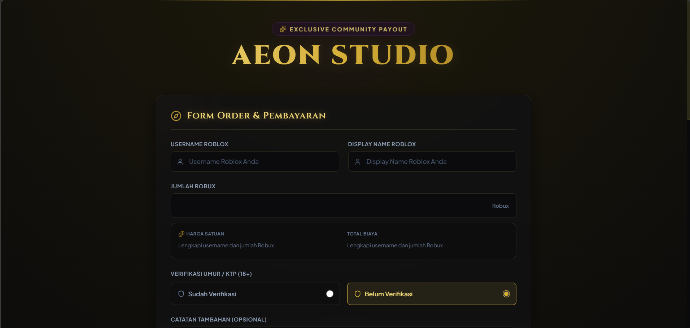
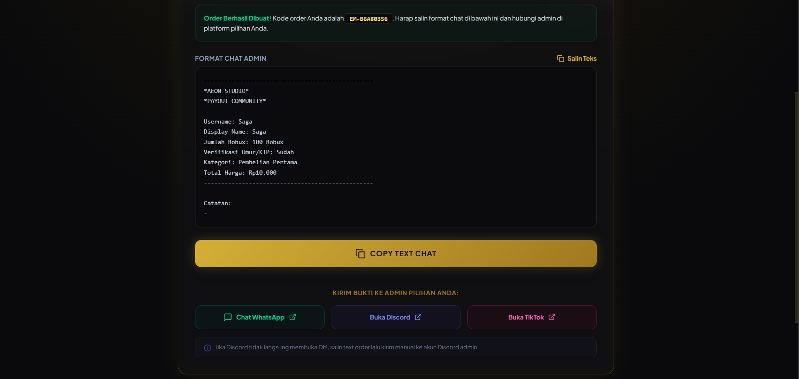
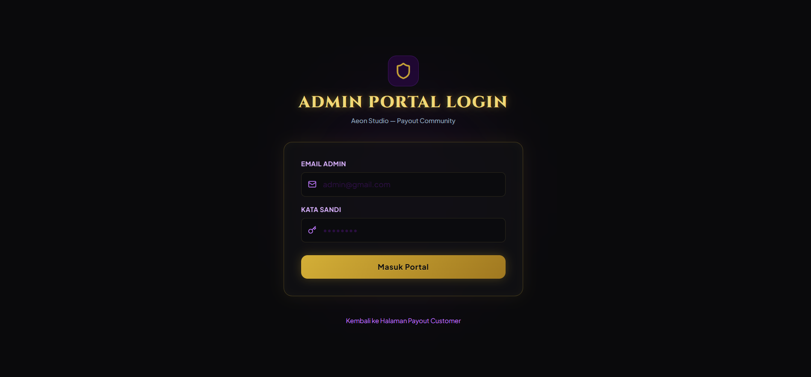
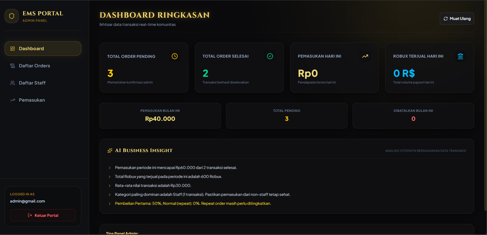

<div align="center">

# 💎 Sistem Order & Payout In-Game Currency Berbasis Web
### Payout Community Portal Modern

**Kelola order dan payout komunitas lebih mudah, lebih rapi, lebih profesional.**

[](https://aeon-studio.vercel.app)
[](https://reactjs.org)
[](https://supabase.com)
[](https://vercel.com)

</div>

---

## 📌 Tentang Aplikasi

**Aeon Studio — Payout Community** adalah aplikasi web portal order dan manajemen payout modern yang dirancang untuk membantu komunitas atau studio dalam mengelola transaksi payout in-game currency secara digital — dari pengajuan order oleh customer, verifikasi bukti pembayaran, hingga dashboard admin lengkap dengan statistik pemasukan, semua dalam satu sistem yang simpel dan profesional.

> Tidak perlu lagi terima order lewat chat satu per satu, tidak ada lagi bukti pembayaran yang terselip, tidak ada lagi transaksi yang terlewat.

---

## ✨ Fitur Utama

- 🧾 **Order Multi-Step** — Customer input data, unggah bukti bayar, dan dapat preview chat otomatis
- 💰 **Kalkulasi Harga Dinamis** — Kategori & tarif dihitung otomatis lewat PostgreSQL RPC function di server
- 📲 **Redirect Multi-Channel** — Chat WhatsApp, Discord, atau TikTok langsung dari halaman konfirmasi
- 🔐 **Login Admin Terproteksi** — Autentikasi terintegrasi Supabase Auth
- 📊 **Dashboard Statistik** — Order pending, order selesai, total pemasukan, dan volume transaksi harian
- 📋 **Kelola Order** — Lightbox preview bukti transfer, konfirmasi selesai, atau batalkan order
- 👥 **Kelola Staff** — Tambah, aktifkan/nonaktifkan, dan kelola data staff komunitas
- 🧾 **Export Laporan PDF** — Unduh laporan income dalam format PDF siap cetak
- 🗄️ **Row Level Security (RLS)** — Keamanan data tingkat database bawaan Supabase
- 🔌 **Offline Demo Mode** — Tetap bisa dijalankan & dicoba tanpa koneksi Supabase sama sekali
- 📱 **Responsive** — Tampilan optimal di desktop maupun mobile

---

## 🖥️ Screenshot

| Halaman Utama | Preview Chat |
|---|---|
|  |  |

| Login Admin | Dashboard Admin |
|---|---|
|  |  |

---

## 🛠️ Tech Stack

| Teknologi | Kegunaan |
|---|---|
| [React 19](https://reactjs.org) + [Vite](https://vitejs.dev) | Framework & build tool frontend |
| [Tailwind CSS](https://tailwindcss.com) | Styling & desain UI |
| [Supabase](https://supabase.com) | Database PostgreSQL, storage, & autentikasi |
| [React Router v7](https://reactrouter.com) | Client-side routing & route guard |
| [jsPDF](https://github.com/parallax/jsPDF) + jsPDF-AutoTable | Export laporan income ke PDF |
| [Lucide React](https://lucide.dev) | Icon library |
| [Vercel](https://vercel.com) | Hosting & deployment |

---

## 🚀 Cara Menjalankan Lokal

### Prasyarat
- Node.js versi 18 atau lebih baru
- Akun [Supabase](https://supabase.com) (gratis)
- Akun [Vercel](https://vercel.com) (gratis)

### 1. Clone / Extract Repository

```bash
git clone <url-repo-anda>
cd aeon-studio
```

### 2. Install Dependencies

```bash
npm install
```

### 3. Setup Environment Variables

Salin file `.env.example` menjadi `.env.local` di root project:

```bash
copy .env.example .env.local
```

Isi dengan kredensial project Supabase Anda:

```env
VITE_SUPABASE_URL=https://your-project-id.supabase.co
VITE_SUPABASE_ANON_KEY=your-actual-anon-public-key
```

> Lihat cara mendapatkan nilai ini di bagian [Setup Supabase](#️-setup-supabase) di bawah.

### 4. Jalankan Development Server

```bash
npm run dev
```

Buka [http://localhost:5173](http://localhost:5173) di browser.

---

## 🗄️ Setup Supabase

### 1. Buat Project Supabase
1. Daftar di [supabase.com](https://supabase.com)
2. Klik **New Project** → isi nama project sesuai keinginan
3. Pilih region terdekat (misal **Southeast Asia (Singapore)**)
4. Tunggu project siap (~2 menit)

### 2. Jalankan SQL Schema
1. Buka menu **SQL Editor → New Query**
2. Copy & paste seluruh isi file [supabase/schema.sql](supabase/schema.sql)
3. Klik **Run**
4. Pastikan tabel `admin_users`, `staff_members`, `transactions`, `app_settings`, serta function `get_order_quote` dan `create_order` berhasil dibuat ✅

### 3. Buat Storage Bucket
1. Buka menu **Storage → New Bucket**
2. Beri nama bucket: `payment-proofs`
3. Aktifkan opsi **Public Bucket** (agar bukti transfer bisa ditampilkan di dashboard admin)

### 4. Ambil Kredensial
1. Buka **Settings → API**
2. Copy **Project URL** → masukkan ke `VITE_SUPABASE_URL`
3. Copy **anon / publishable key** → masukkan ke `VITE_SUPABASE_ANON_KEY`

### 5. Buat Akun Admin
1. Buka **Authentication → Users → Add User**
2. Isi email & password admin
3. Aktifkan **Auto Confirm User**

### 6. Sesuaikan Pengaturan Brand
Ubah data komunitas Anda langsung lewat SQL Editor:

```sql
UPDATE app_settings SET value = 'Nama Studio Anda' WHERE key = 'brand_name';
UPDATE app_settings SET value = '628xxxxxxxxxx' WHERE key = 'whatsapp_number';
UPDATE app_settings SET value = 'https://discord.gg/xxxxxxx' WHERE key = 'discord_url';
UPDATE app_settings SET value = 'https://www.tiktok.com/@xxxxxxx' WHERE key = 'tiktok_url';
```

Jangan lupa ganti juga gambar QRIS pembayaran Anda di `public/payment-qr.png`.

---

## ☁️ Deploy ke Vercel

### 1. Push ke GitHub
```bash
git add .
git commit -m "initial commit"
git push origin main
```

### 2. Import di Vercel
1. Buka [vercel.com](https://vercel.com) → **Add New Project**
2. Import repository dari GitHub
3. Tambahkan **Environment Variables**:
   - `VITE_SUPABASE_URL`
   - `VITE_SUPABASE_ANON_KEY`
4. Centang semua environment: **Production, Preview, Development**
5. Klik **Deploy** 🚀

---

## 🔑 Environment Variables

| Variable | Deskripsi | Wajib |
|---|---|---|
| `VITE_SUPABASE_URL` | URL project Supabase | ✅ |
| `VITE_SUPABASE_ANON_KEY` | Anon / publishable key Supabase | ✅ |

---

## 👥 Role & Akses

| Role | Akses |
|---|---|
| **Pengunjung / Customer** | Ajukan order, unggah bukti bayar, lihat preview chat |
| **Admin** | Dashboard statistik, kelola order, kelola staff, export laporan PDF |

> 💡 Login admin dilakukan di halaman `/admin` (tidak ada link dari halaman publik).

### Akun Demo (Offline Mode)

Jika `.env.local` tidak diisi atau masih placeholder, aplikasi otomatis berjalan dalam **Offline Demo Mode** menggunakan `localStorage`.

| Role | Email | Password |
|---|---|---|
| Admin | `admin@gmail.com` | `admin123` |

---

## 📁 Struktur Project

```
aeon-studio/
├── src/
│   ├── components/
│   │   ├── HeaderHero.jsx           # Judul & hero halaman publik
│   │   ├── OrderFormStep.jsx        # Form order + upload bukti bayar
│   │   ├── ChatPreviewStep.jsx      # Preview format chat & redirect admin
│   │   ├── AdminLogin.jsx           # Halaman login admin
│   │   ├── AdminLayout.jsx          # Sidebar & layout dashboard admin
│   │   ├── AdminDashboard.jsx       # Statistik ringkasan admin
│   │   ├── AdminOrders.jsx          # Kelola order masuk
│   │   ├── AdminStaff.jsx           # Kelola data staff
│   │   └── AdminIncome.jsx         # Laporan income + export PDF
│   ├── lib/
│   │   ├── supabase.js              # Konfigurasi Supabase + mode offline
│   │   └── utils.js                 # Helper format chat, WhatsApp link, dll
│   └── App.jsx                      # Routing & pengaturan global
├── supabase/
│   └── schema.sql                   # Schema DB + RLS + function
├── public/
│   └── payment-qr.png               # QRIS pembayaran
├── .env.example
├── index.html
├── vite.config.js
└── package.json
```

---

## 🗺️ Roadmap

- [x] Order multi-step dengan upload bukti bayar
- [x] Kalkulasi harga & kategori otomatis via RPC
- [x] Redirect multi-channel (WhatsApp, Discord, TikTok)
- [x] Dashboard admin dengan statistik real-time
- [x] Kelola order & staff
- [x] Export laporan PDF
- [x] Offline demo mode
- [ ] Notifikasi WhatsApp otomatis saat status order berubah
- [ ] Multi-admin dengan role & permission berbeda
- [ ] Riwayat log aktivitas admin

---

<div align="center">

⭐ Jangan lupa beri bintang jika project ini membantu!

[](https://aeon-studio.vercel.app)

</div>
