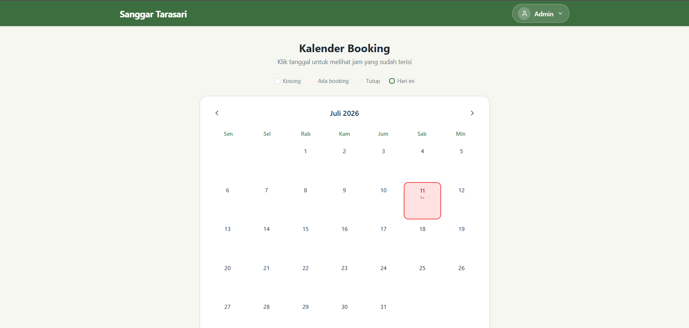
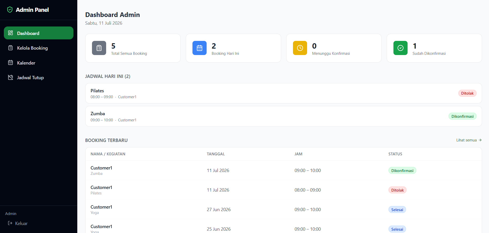
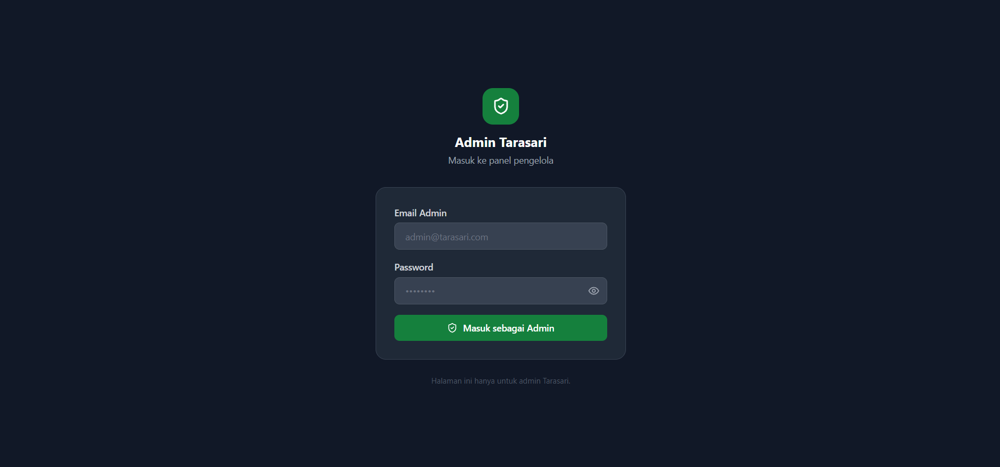

<div align="center">

# 🗓️ Sistem Manajemen Reservasi Online Berbasis AI
### Platform Booking Sanggar & Studio Modern

**Kelola jadwal reservasi lebih mudah, lebih rapi, lebih profesional.**

[](https://reservasi-online.vercel.app)
[](https://reactjs.org)
[](https://supabase.com)
[](https://vercel.com)

</div>

---

## 📌 Tentang Aplikasi

**Sistem Manajemen Reservasi Online Berbasis AI** adalah aplikasi web reservasi modern yang dirancang untuk membantu pemilik sanggar, studio senam, studio tari, atau tempat latihan lainnya dalam mengelola jadwal booking secara digital — dari pengajuan booking oleh customer, konfirmasi admin, hingga kalender jadwal real-time, semua dalam satu dashboard yang simpel dan profesional.

> Tidak perlu lagi terima booking lewat chat satu per satu, tidak ada lagi jadwal yang bentrok, tidak ada lagi booking yang terlewat.

---

## ✨ Fitur Utama

- 🔐 **Autentikasi Multi-Role** — Login terpisah untuk Customer dan Admin
- 📆 **Kalender Publik** — Pengunjung bisa lihat jadwal booking tanpa perlu login
- 📝 **Form Booking Online** — Customer ajukan booking dengan validasi jam & tanggal otomatis
- ✅ **Kelola Booking (Admin)** — Terima, tolak, atau batalkan booking dari dashboard
- 🗓️ **Kalender Admin** — Tampilan kalender lengkap + tambah booking manual untuk customer offline
- 🚫 **Jadwal Tutup** — Admin bisa tandai tanggal libur/tutup agar tidak bisa diboking
- 📊 **Dashboard Ringkasan** — Statistik booking hari ini, menunggu konfirmasi, dan sudah dikonfirmasi
- 🤖 **AI Booking Assistant** — Asisten AI untuk membantu pengelolaan reservasi
- 🔒 **Keamanan Data** — Row Level Security (RLS) Supabase — customer hanya bisa lihat data sendiri
- 📱 **Responsive** — Tampilan optimal di desktop maupun mobile

---

## 🖥️ Screenshot

| Halaman Utama | Dashboard Admin |
|---|---|
|  |  |

| Login Admin |
|---|
|  | 

---

## 🛠️ Tech Stack

| Teknologi | Kegunaan |
|---|---|
| [React 18](https://reactjs.org) + [Vite 5](https://vitejs.dev) | Framework & build tool frontend |
| [Tailwind CSS](https://tailwindcss.com) | Styling & desain UI |
| [Supabase](https://supabase.com) | Database PostgreSQL & autentikasi |
| [React Router v6](https://reactrouter.com) | Client-side routing & route guard |
| [date-fns](https://date-fns.org) | Utilitas tanggal & kalender |
| [Lucide React](https://lucide.dev) | Icon library |
| [Vercel](https://vercel.com) | Hosting & deployment |

---

## 🚀 Cara Menjalankan Lokal

### Prasyarat
- Node.js versi 18 atau lebih baru
- Akun [Supabase](https://supabase.com) (gratis)
- Akun [Vercel](https://vercel.com) (gratis)

### 1. Clone Repository

```bash
git clone https://github.com/Sagasen/Web-Projects.git
cd Web-Projects/05-reservasi-online
```

### 2. Install Dependencies

```bash
npm install
```

### 3. Setup Environment Variables

Buat file `.env` di root project:

```env
VITE_SUPABASE_URL=https://xxxxxxxx.supabase.co
VITE_SUPABASE_ANON_KEY=sb_publishable_xxxxxxxxxxxxxxxx
```

> Lihat cara mendapatkan nilai ini di bagian [Setup Supabase](#️-setup-supabase) di bawah.

### 4. Jalankan Development Server

```bash
npm run dev
```

Buka [http://localhost:5200](http://localhost:5200) di browser.

---

## 🗄️ Setup Supabase

### 1. Buat Project Supabase
1. Daftar di [supabase.com](https://supabase.com)
2. Klik **New Project** → isi nama: `reservasi-online`
3. Pilih region: **Southeast Asia (Singapore)**
4. Tunggu project siap (~2 menit)

### 2. Ambil Kredensial
1. Buka **Settings → API**
2. Copy **Project URL** → masukkan ke `VITE_SUPABASE_URL`
3. Copy **Publishable key** → masukkan ke `VITE_SUPABASE_ANON_KEY`

### 3. Buat Tabel Database
1. Buka **SQL Editor → New Query**
2. Copy & paste isi file `supabase/migrations/001_init.sql`
3. Klik **Run**
4. Semua tabel, RLS, trigger, dan view akan otomatis terbuat ✅

### 4. Buat Akun Admin
1. Buka **Authentication → Users → Add User**
2. Isi email & password admin
3. Di bagian **User Metadata**, masukkan:
```json
{ "role": "admin", "full_name": "Nama Admin" }
```

---

## ☁️ Deploy ke Vercel

### 1. Push ke GitHub
```bash
git add .
git commit -m "initial commit"
git push origin main
```

### 2. Import di Vercel
1. Buka [vercel.com](https://vercel.com) → **Add New Project**
2. Import repository dari GitHub
3. Tambahkan **Environment Variables**:
   - `VITE_SUPABASE_URL`
   - `VITE_SUPABASE_ANON_KEY`
4. Centang semua environment: **Production, Preview, Development**
5. Klik **Deploy** 🚀

---

## 🔑 Environment Variables

| Variable | Deskripsi | Wajib |
|---|---|---|
| `VITE_SUPABASE_URL` | URL project Supabase | ✅ |
| `VITE_SUPABASE_ANON_KEY` | Publishable key Supabase | ✅ |

---

## 👥 Role & Akses

| Role | Akses |
|---|---|
| **Pengunjung** | Lihat kalender booking publik |
| **Customer** | Kalender, booking baru, riwayat & status booking sendiri |
| **Admin** | Dashboard, kelola semua booking, kalender admin, jadwal tutup |

> 💡 Login admin dilakukan di halaman `/admin` (tidak ada link dari halaman publik).

### Akun Demo

| Role | Email | Password |
|---|---|---|
| Customer | customer@gmail.com | customer |
| Admin | admin@gmail.com | admin123 |

---

## 📁 Struktur Project

```
05-reservasi-online/
├── src/
│   ├── components/
│   │   └── layout/
│   │       ├── PublicLayout.jsx       # Navbar publik dengan profil dropdown
│   │       ├── CustomerLayout.jsx     # Layout dashboard customer
│   │       ├── AdminLayout.jsx        # Sidebar admin panel
│   │       ├── RequireAuth.jsx        # Guard: wajib login
│   │       └── RequireAdminRole.jsx   # Guard: wajib role admin
│   ├── pages/
│   │   ├── public/
│   │   │   ├── CalendarPage.jsx       # Kalender booking publik
│   │   │   ├── LoginPage.jsx          # Login customer
│   │   │   └── SignupPage.jsx         # Daftar akun baru
│   │   ├── customer/
│   │   │   ├── DashboardPage.jsx      # Riwayat booking customer
│   │   │   ├── BookingFormPage.jsx    # Form booking baru
│   │   │   └── BookingSuccessPage.jsx # Konfirmasi booking berhasil
│   │   └── admin/
│   │       ├── AdminLoginPage.jsx     # Login admin (/admin)
│   │       ├── AdminDashboardPage.jsx # Dashboard ringkasan admin
│   │       ├── AdminBookingsPage.jsx  # Kelola semua booking
│   │       ├── AdminCalendarPage.jsx  # Kalender admin + booking manual
│   │       └── AdminClosedDatesPage.jsx # Jadwal tutup/libur
│   ├── lib/
│   │   ├── supabaseClient.js          # Konfigurasi Supabase
│   │   ├── authUtils.js               # Helper fungsi autentikasi
│   │   └── AuthContext.jsx            # Global auth state (session, role)
│   └── routes/
│       └── AppRoutes.jsx              # Routing lengkap + semua guard
├── supabase/
│   └── migrations/
│       └── 001_init.sql               # Schema DB + RLS + trigger
├── .env.example
├── index.html
├── vite.config.js
├── tailwind.config.js
└── package.json
```

---

## 🗺️ Roadmap

- [x] Autentikasi multi-role (Customer & Admin)
- [x] Kalender booking publik (tanpa login)
- [x] Form booking dengan validasi bentrok jam
- [x] Dashboard admin — terima / tolak booking
- [x] Kalender admin + booking manual
- [x] Jadwal tutup / libur
- [x] AI Booking Assistant
- [x] Responsive mobile & desktop
- [ ] Notifikasi WhatsApp saat status booking berubah
- [ ] Export laporan booking ke PDF/Excel
- [ ] Multi studio (satu akun kelola beberapa tempat)
- [ ] Reminder H-1 booking otomatis

---

<div align="center">

⭐ Jangan lupa beri bintang jika project ini membantu!

[](https://reservasi-online.vercel.app)

</div>