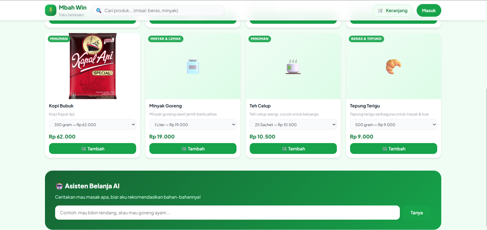
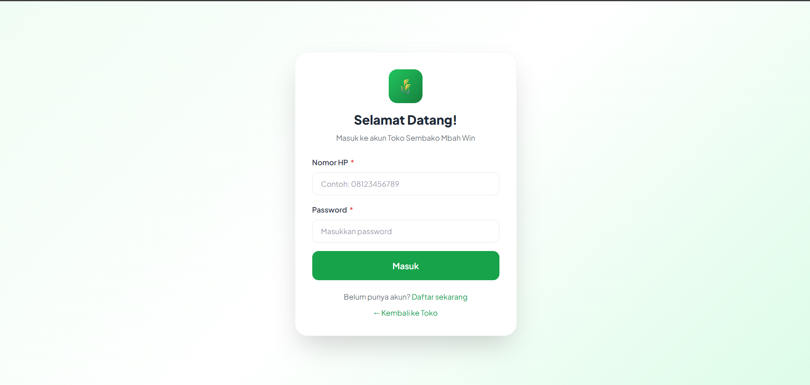
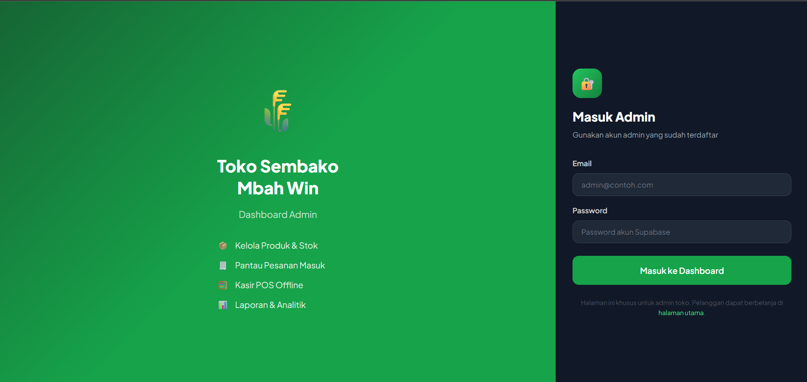
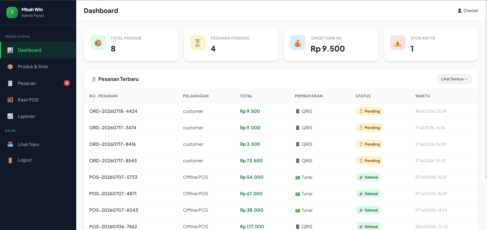

# 🛒 TokoAI - Platform E-Commerce dengan Asisten Belanja AI

### Toko Online + Kasir (POS) untuk UMKM Retail

**Kelola toko lebih mudah, lebih rapi, lebih pintar — dengan bantuan AI.**

[](https://platform-ecommerce-umkm.vercel.app)
[](https://reactjs.org)
[](https://supabase.com)
[](https://ai.google.dev)
[](https://vercel.com)

---

## 📌 Tentang Aplikasi

**TokoAI** adalah platform e-commerce dan kasir (POS) yang dirancang fleksibel untuk kebutuhan UMKM retail — mulai dari toko kelontong, toko sembako, hingga jenis retail kecil lainnya. Demo yang ditampilkan di repo ini adalah implementasi untuk **toko sembako**, tapi struktur sistemnya (katalog produk bervarian, keranjang, checkout, kasir, laporan) bisa diadaptasi ke jenis produk apa pun.

> Pelanggan tinggal ceritakan mau masak apa, AI akan merekomendasikan resep sekaligus bahan-bahan yang tersedia di toko — langsung bisa ditambahkan ke keranjang.

---

## ✨ Fitur Utama

- 🛍️ **Katalog Produk Bervarian** — Satu produk bisa punya banyak varian ukuran & harga
- 🛒 **Keranjang & Checkout** — Checkout dengan konfirmasi otomatis via WhatsApp
- 💳 **Pembayaran QRIS/Transfer** — Upload bukti pembayaran langsung dari checkout
- 🧾 **Invoice PDF** — Pelanggan bisa unduh invoice tiap pesanan
- 🤖 **Asisten Belanja AI** — Rekomendasi resep & bahan masakan berbasis Gemini API, dengan fallback resep lokal saat AI tidak tersedia
- 🔐 **Autentikasi Multi-Role** — Login terpisah untuk Customer, Kasir, dan Owner
- 🧮 **Kasir POS** — Transaksi offline langsung dari panel admin
- 📊 **Dashboard Laporan** — Grafik pendapatan harian, estimasi laba, total transaksi
- 📦 **Manajemen Produk & Stok** — Kelola produk, varian, dan stok dari satu tempat
- 🔒 **Keamanan Data** — Row Level Security (RLS) Supabase per role
- 📱 **Responsive** — Tampilan optimal di desktop maupun mobile

---

## 🖥️ Screenshot

| Etalase Toko | Login Customer |
| --- | --- |
| [](images/dashboard.png) | [](images/login_customer.png) |

| Login Admin | Dashboard Admin |
| --- | --- |
| [](images/login_admin.png) | [](images/dashboard_admin.png) |

---

## 🛠️ Tech Stack

| Teknologi | Kegunaan |
| --- | --- |
| [React 18](https://reactjs.org) + [Vite 5](https://vitejs.dev) | Framework & build tool frontend |
| [Supabase](https://supabase.com) | Database PostgreSQL & autentikasi |
| [React Router v6](https://reactrouter.com) | Client-side routing & route guard |
| [Gemini API](https://ai.google.dev) | Asisten belanja AI (rekomendasi resep) |
| [jsPDF](https://github.com/parallax/jsPDF) | Generate invoice PDF |
| [Vercel](https://vercel.com) | Hosting & deployment |

---

## 🚀 Cara Menjalankan Lokal

### Prasyarat

- Node.js versi 18 atau lebih baru
- Akun [Supabase](https://supabase.com) (gratis)
- Akun [Google AI Studio](https://aistudio.google.com/apikey) (gratis, untuk Gemini API key)
- Akun [Vercel](https://vercel.com) (gratis)

### 1. Clone Repository

```bash
git clone https://github.com/Sagasen/Web-Projects.git
cd Web-Projects/06-toko-sembako
```

### 2. Install Dependencies

```bash
npm install
```

### 3. Setup Environment Variables

Buat file `.env` di root project:

```
VITE_SUPABASE_URL=https://xxxxxxxx.supabase.co
VITE_SUPABASE_ANON_KEY=sb_publishable_xxxxxxxxxxxxxxxx
VITE_GEMINI_API_KEY=AIzaSyxxxxxxxxxxxxxxxxxxxxxxxxxxxx
```

> Lihat cara mendapatkan nilai ini di bagian [Setup Supabase](#️-setup-supabase) di bawah.

### 4. Jalankan Development Server

```bash
npm run dev
```

Buka <http://localhost:5173> di browser.

---

## 🗄️ Setup Supabase

### 1. Buat Project Supabase

1. Daftar di [supabase.com](https://supabase.com)
2. Klik **New Project** → isi nama: `toko-sembako`
3. Pilih region: **Southeast Asia (Singapore)**
4. Tunggu project siap (~2 menit)

### 2. Ambil Kredensial

1. Buka **Settings → API**
2. Copy **Project URL** → masukkan ke `VITE_SUPABASE_URL`
3. Copy **Publishable key** → masukkan ke `VITE_SUPABASE_ANON_KEY`

### 3. Buat Tabel Database

1. Buka **SQL Editor → New Query**
2. Copy & paste isi file `supabase_migration.sql`
3. Klik **Run**
4. Semua tabel, RLS, dan trigger akan otomatis terbuat ✅

### 4. Buat Akun Kasir & Owner

1. Buka **Authentication → Users → Add User**, buat akun untuk kasir dan owner
2. Buka **SQL Editor**, jalankan insert ke tabel `admin_profiles` dengan `id` sesuai UID akun yang baru dibuat, dan `role` diisi `'kasir'` atau `'owner'`

### 5. Dapatkan Gemini API Key

1. Buka [aistudio.google.com/apikey](https://aistudio.google.com/apikey)
2. Klik **Create API key**, copy → masukkan ke `VITE_GEMINI_API_KEY`

---

## ☁️ Deploy ke Vercel

### 1. Push ke GitHub

```bash
git add .
git commit -m "initial commit"
git push origin main
```

### 2. Import di Vercel

1. Buka [vercel.com](https://vercel.com) → **Add New Project**
2. Import repository dari GitHub
3. Tambahkan **Environment Variables**:
   - `VITE_SUPABASE_URL`
   - `VITE_SUPABASE_ANON_KEY`
   - `VITE_GEMINI_API_KEY`
4. Centang semua environment: **Production, Preview, Development**
5. Klik **Deploy** 🚀

> ⚠️ Setiap kali menambah/mengubah environment variable di Vercel, wajib **Redeploy** manual agar perubahan berlaku.

---

## 🔑 Environment Variables

| Variable | Deskripsi | Wajib |
| --- | --- | --- |
| `VITE_SUPABASE_URL` | URL project Supabase | ✅ |
| `VITE_SUPABASE_ANON_KEY` | Publishable key Supabase | ✅ |
| `VITE_GEMINI_API_KEY` | API key Gemini untuk Asisten Belanja AI | ⚙️ Opsional (fallback ke resep lokal jika kosong) |

---

## 👥 Role & Akses

| Role | Akses |
| --- | --- |
| **Pengunjung/Customer** | Lihat katalog, belanja, checkout, riwayat pesanan sendiri |
| **Kasir** | Kasir POS, kelola pesanan online |
| **Owner** | Semua akses Kasir + Dashboard laporan, manajemen produk & stok |

> 💡 Login admin (Kasir/Owner) dilakukan di halaman `/admin` (tidak ada link dari halaman publik).

### Akun Demo

| Role | Email / No. HP | Password |
| --- | --- | --- |
| Customer | 081234567890 | `customer` |
| Kasir | kasir@gmail.com | `kasir123` |
| Owner | owner@gmail.com | `owner123` |

---

## 📁 Struktur Project

```
06-toko-sembako/
├── src/
│   ├── components/
│   │   ├── ProtectedCustomerRoute.jsx   # Guard: wajib login customer
│   │   └── ProtectedOwnerRoute.jsx      # Guard: wajib role owner
│   ├── context/
│   │   ├── CustomerAuthContext.jsx      # Auth state customer
│   │   ├── CartContext.jsx              # State keranjang belanja
│   │   └── ToastContext.jsx             # Notifikasi toast
│   ├── lib/
│   │   ├── supabase.js                  # Konfigurasi Supabase client
│   │   ├── aiRecipe.js                  # Integrasi Gemini API (Asisten Belanja AI)
│   │   └── invoice.js                   # Generator invoice PDF (jsPDF)
│   ├── pages/
│   │   ├── Katalog.jsx                  # Etalase produk + Asisten Belanja AI
│   │   ├── Cart.jsx / Checkout.jsx       # Keranjang & checkout
│   │   ├── Orders.jsx                   # Riwayat pesanan customer
│   │   ├── Login.jsx / Register.jsx      # Autentikasi customer
│   │   └── admin/
│   │       ├── AdminLogin.jsx           # Login khusus admin
│   │       ├── AdminDashboard.jsx       # Ringkasan dashboard
│   │       ├── AdminProducts.jsx        # Manajemen produk & stok
│   │       ├── AdminKasir.jsx           # Kasir POS
│   │       ├── AdminOrders.jsx          # Kelola pesanan online
│   │       └── AdminReport.jsx          # Laporan penjualan
│   └── styles/
│       └── index.css
├── supabase_migration.sql               # Schema database
├── .env.example
├── vite.config.js
└── package.json
```

---

## 🗺️ Roadmap

- [x] Katalog produk bervarian
- [x] Keranjang & checkout via WhatsApp
- [x] Pembayaran QRIS/transfer + upload bukti
- [x] Invoice PDF
- [x] Asisten Belanja AI (Gemini) dengan fallback resep lokal
- [x] Kasir POS
- [x] Dashboard laporan penjualan
- [x] Role Kasir & Owner dengan RLS
- [ ] Notifikasi WhatsApp otomatis saat status pesanan berubah
- [ ] Export laporan ke Excel
- [ ] Multi-toko (satu akun kelola beberapa cabang)
- [ ] Riwayat & tracking stok masuk/keluar lebih detail

---

⭐ Jangan lupa beri bintang jika project ini membantu!

[](https://platform-ecommerce-umkm.vercel.app)
